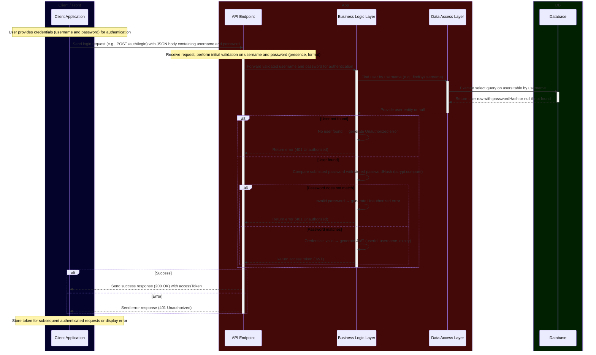

# Login / Obtain authentication token

```mermaid
sequenceDiagram
    box rgb(3, 3, 44) Client / Front
    participant Client as Client Application
    end
    box rgb(67, 8, 8) App
    participant API as API Endpoint
    participant Logic as Business Logic Layer
    participant DataAccess as Data Access Layer
    end
    box rgb(1, 31, 1) DB
    participant Database
    end

    Note over Client: User provides credentials (username and password) for authentication
    Client->>API: Send login request (e.g., POST /auth/login) with JSON body containing username and password
    Note over API: Receive request, perform initial validation on username and password (presence, format)

    activate API
    API->>Logic: Forward validated username and password for authentication

    activate Logic
    Logic->>DataAccess: Find user by username (e.g., findByUsername)

    activate DataAccess
    DataAccess->>Database: Execute select query on users table by username

    activate Database
    Database-->>DataAccess: Return user row with passwordHash or null if not found
    deactivate Database

    DataAccess-->>Logic: Provide user entity or null
    deactivate DataAccess

    alt User not found
        Logic->>Logic: No user found → generate Unauthorized error
        Logic-->>API: Return error (401 Unauthorized)
    else User found
        Logic->>Logic: Compare submitted password with stored passwordHash (bcrypt.compare)

        alt Password does not match
            Logic->>Logic: Invalid password → generate Unauthorized error
            Logic-->>API: Return error (401 Unauthorized)
        else Password matches
            Logic->>Logic: Credentials valid → generate JWT (userId, username, expiry)
            Logic-->>API: Return access token (JWT)
        end
    end

    deactivate Logic

    alt Success
        API-->>Client: Send success response (200 OK) with accessToken
    else Error
        API-->>Client: Send error response (401 Unauthorized)
    end

    deactivate API
    Note over Client: Store token for subsequent authenticated requests or display error
```
