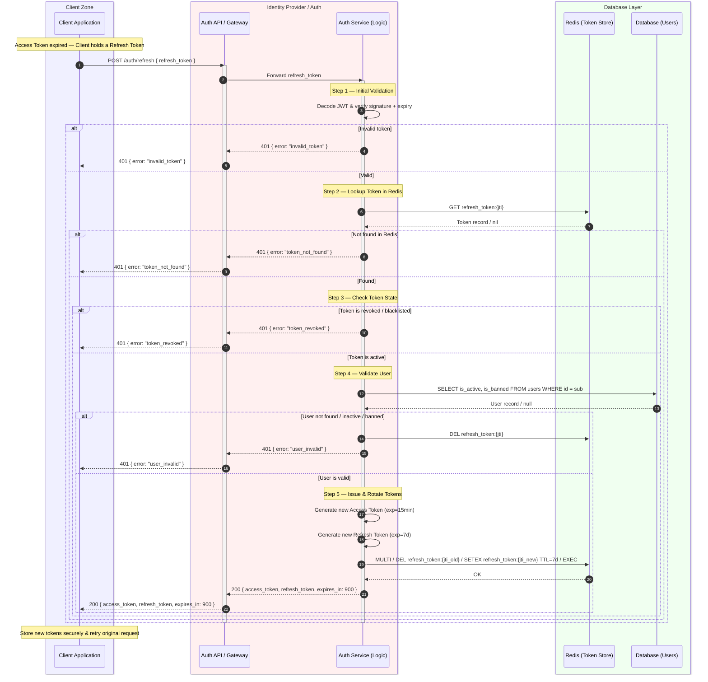

# Refresh Token

```mermaid
sequenceDiagram
    autonumber
    box rgb(240, 240, 255) Client Zone
    participant Client as Client Application
    end
    box rgb(255, 240, 240) Identity Provider / Auth
    participant API as Auth API / Gateway
    participant Logic as Auth Service (Logic)
    end
    box rgb(240, 255, 240) Database Layer
    participant Cache as Redis (Token Store)
    participant DB as Database (Users)
    end

    Note over Client: Access Token expired — Client holds a Refresh Token
    Client->>API: POST /auth/refresh { refresh_token }
    activate API
    API->>Logic: Forward refresh_token
    activate Logic

    Note over Logic: Step 1 — Initial Validation
    Logic->>Logic: Decode JWT & verify signature + expiry
    alt Invalid token
        Logic-->>API: 401 { error: "invalid_token" }
        API-->>Client: 401 { error: "invalid_token" }
    else Valid
        Note over Logic: Step 2 — Lookup Token in Redis
        Logic->>Cache: GET refresh_token:{jti}
        Cache-->>Logic: Token record / nil
        alt Not found in Redis
            Logic-->>API: 401 { error: "token_not_found" }
            API-->>Client: 401 { error: "token_not_found" }
        else Found
            Note over Logic: Step 3 — Check Token State
            alt Token is revoked / blacklisted
                Logic-->>API: 401 { error: "token_revoked" }
                API-->>Client: 401 { error: "token_revoked" }
            else Token is active
                Note over Logic: Step 4 — Validate User
                Logic->>DB: SELECT is_active, is_banned FROM users WHERE id = sub
                DB-->>Logic: User record / null
                alt User not found / inactive / banned
                    Logic->>Cache: DEL refresh_token:{jti}
                    Logic-->>API: 401 { error: "user_invalid" }
                    API-->>Client: 401 { error: "user_invalid" }
                else User is valid
                    Note over Logic: Step 5 — Issue & Rotate Tokens
                    Logic->>Logic: Generate new Access Token (exp=15min)
                    Logic->>Logic: Generate new Refresh Token (exp=7d)
                    Logic->>Cache: MULTI / DEL refresh_token:{jti_old} / SETEX refresh_token:{jti_new} TTL=7d / EXEC
                    Cache-->>Logic: OK
                    Logic-->>API: 200 { access_token, refresh_token, expires_in: 900 }
                    API-->>Client: 200 { access_token, refresh_token, expires_in: 900 }
                end
            end
        end
    end

    deactivate Logic
    deactivate API

    Note over Client: Store new tokens securely & retry original request                                                             
    
```
