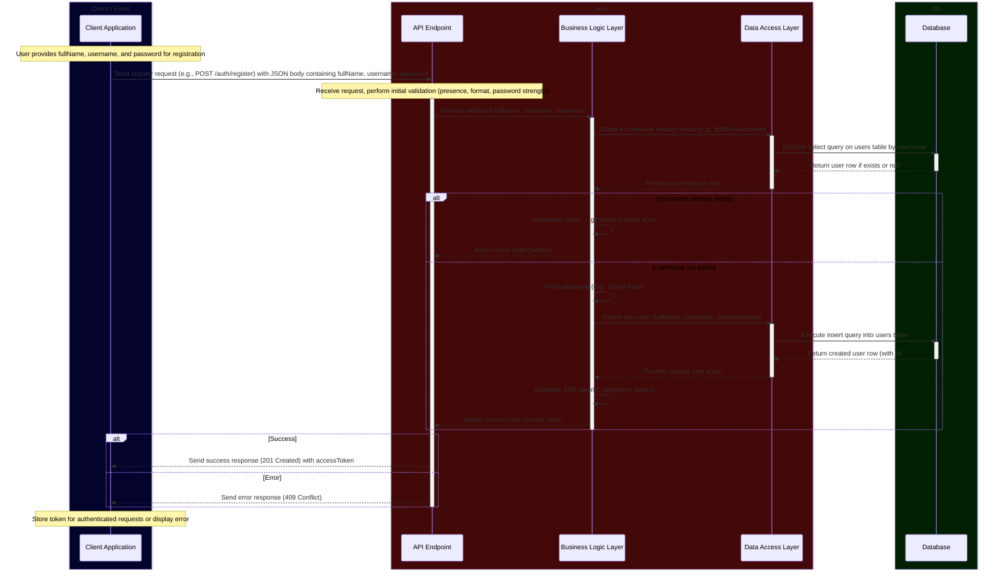

# Login / Obtain authentication token

```mermaid
sequenceDiagram
    box rgb(3, 3, 44) Client / Front
    participant Client as Client Application
    end
    box rgb(67, 8, 8) App
    participant API as API Endpoint
    participant Logic as Business Logic Layer
    participant DataAccess as Data Access Layer
    end
    box rgb(1, 31, 1) DB
    participant Database
    end

    Note over Client: User provides fullName, username, and password for registration
    Client->>API: Send register request (e.g., POST /auth/register) with JSON body containing fullName, username, password
    Note over API: Receive request, perform initial validation (presence, format, password strength)

    activate API
    API->>Logic: Forward validated fullName, username, password

    activate Logic
    Logic->>DataAccess: Check if username already exists (e.g., findByUsername)

    activate DataAccess
    DataAccess->>Database: Execute select query on users table by username

    activate Database
    Database-->>DataAccess: Return user row if exists or null
    deactivate Database

    DataAccess-->>Logic: Provide user entity or null
    deactivate DataAccess

    alt Username already exists
        Logic->>Logic: Username taken → generate Conflict error
        Logic-->>API: Return error (409 Conflict)
    else Username not exists
        Logic->>Logic: Hash password (e.g., bcrypt.hash)
        Logic->>DataAccess: Create new user (fullName, username, passwordHash)

        activate DataAccess
        DataAccess->>Database: Execute insert query into users table
        activate Database
        Database-->>DataAccess: Return created user row (with id)
        deactivate Database
        DataAccess-->>Logic: Provide created user entity
        deactivate DataAccess

        Logic->>Logic: Generate JWT (userId, username, expiry)
        Logic-->>API: Return success with access token
    end

    deactivate Logic

    alt Success
        API-->>Client: Send success response (201 Created) with accessToken
    else Error
        API-->>Client: Send error response (409 Conflict)
    end

    deactivate API
    Note over Client: Store token for authenticated requests or display error
```
