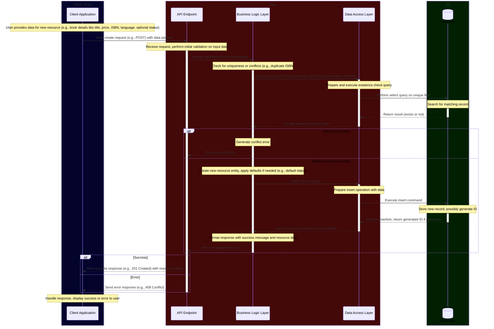

# Create book

```mermaid
sequenceDiagram
    box rgb(3, 3, 44) Client / Front
    participant Client as Client Application
    end
    box rgb(67, 8, 8) App
    participant API as API Endpoint
    participant Logic as Business Logic Layer
    participant DataAccess as Data Access Layer
    end
    box rgb(1, 31, 1) DB
    participant Database@{"type":"database"}
    end
    Note over Client: User provides data for new resource (e.g., book details like title, price, ISBN, language, optional status)
    Client->>API: Send create request (e.g., POST) with data payload
    Note over API: Receive request, perform initial validation on input data
    activate API
    API->>Logic: Forward validated data for processing
    Note over Logic: Check for uniqueness or conflicts (e.g., duplicate ISBN)
    activate Logic
    Logic->>DataAccess: Query to check if resource already exists based on unique identifier
    activate DataAccess
    Note over DataAccess: Prepare and execute existence check query
    DataAccess->>Database: Perform select query on unique field
    Note over Database: Search for matching record
    activate Database
    Database-->>DataAccess: Return result (exists or not)
    deactivate Database
    DataAccess-->>Logic: Provide existence check result
    deactivate DataAccess
    alt Resource exists
        Note over Logic: Generate conflict error
        Logic-->>API: Return error details
    else Resource does not exist
        Note over Logic: Create new resource entity, apply defaults if needed (e.g., default status)
        Logic->>DataAccess: Insert new resource
        activate DataAccess
        Note over DataAccess: Prepare insert operation with data
        DataAccess->>Database: Execute insert command
        Note over Database: Store new record, possibly generate ID
        activate Database
        Database-->>DataAccess: Confirm insertion, return generated ID if applicable
        deactivate Database
        DataAccess-->>Logic: Return success and new resource details
        deactivate DataAccess
        Note over Logic: Format response with success message and resource data
        Logic-->>API: Return created resource
    end
    deactivate Logic
    alt Success
        API-->>Client: Send success response (e.g., 201 Created) with resource details
    else Error
        API-->>Client: Send error response (e.g., 409 Conflict)
    end
    deactivate API
    Note over Client: Handle response, display success or error to user
```