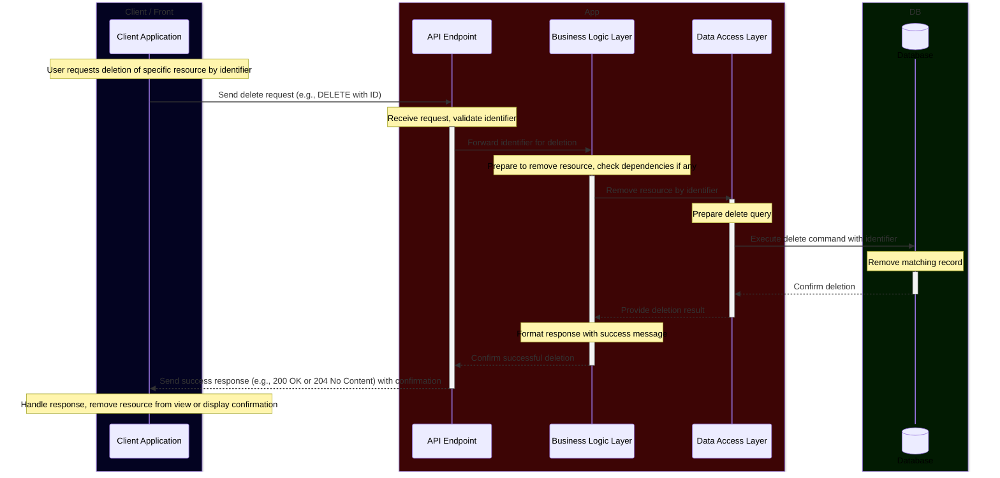

# Delete Book

```mermaid
sequenceDiagram
    box rgb(3, 3, 33) Client / Front
    participant Client as Client Application
    end
    box rgb(61, 5, 5) App
    participant API as API Endpoint
    participant Logic as Business Logic Layer
    participant DataAccess as Data Access Layer
    end
    box rgb(2, 27, 2) DB
    participant Database@{"type":"database"}
    end
    Note over Client: User requests deletion of specific resource by identifier
    Client->>API: Send delete request (e.g., DELETE with ID)
    Note over API: Receive request, validate identifier
    activate API
    API->>Logic: Forward identifier for deletion
    Note over Logic: Prepare to remove resource, check dependencies if any
    activate Logic
    Logic->>DataAccess: Remove resource by identifier
    activate DataAccess
    Note over DataAccess: Prepare delete query
    DataAccess->>Database: Execute delete command with identifier
    Note over Database: Remove matching record
    activate Database
    Database-->>DataAccess: Confirm deletion
    deactivate Database
    DataAccess-->>Logic: Provide deletion result
    deactivate DataAccess
    Note over Logic: Format response with success message
    Logic-->>API: Confirm successful deletion
    deactivate Logic
    API-->>Client: Send success response (e.g., 200 OK or 204 No Content) with confirmation
    deactivate API
    Note over Client: Handle response, remove resource from view or display confirmation

```