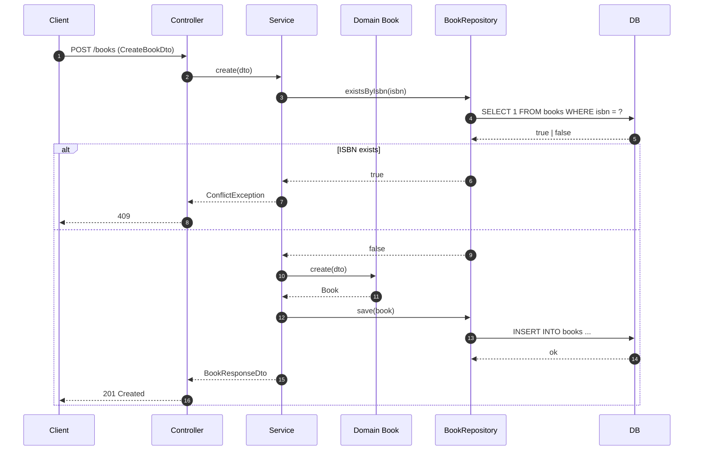
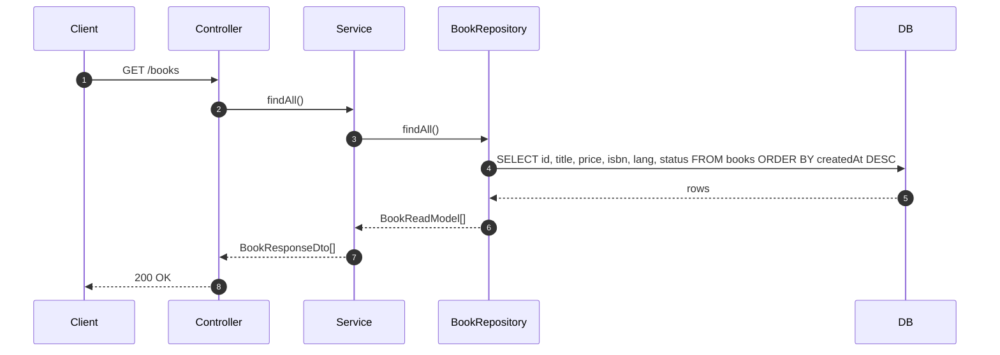
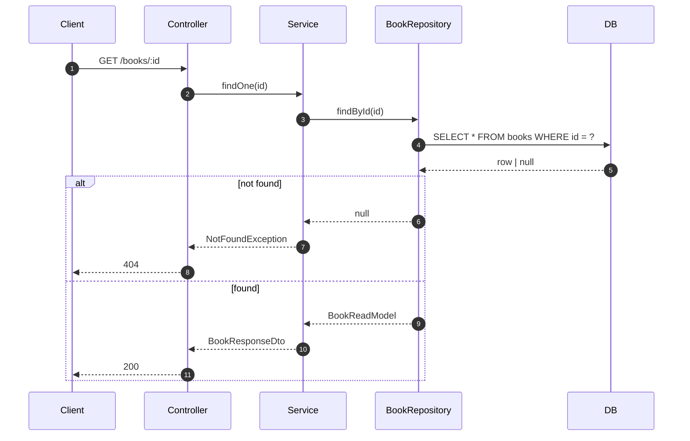
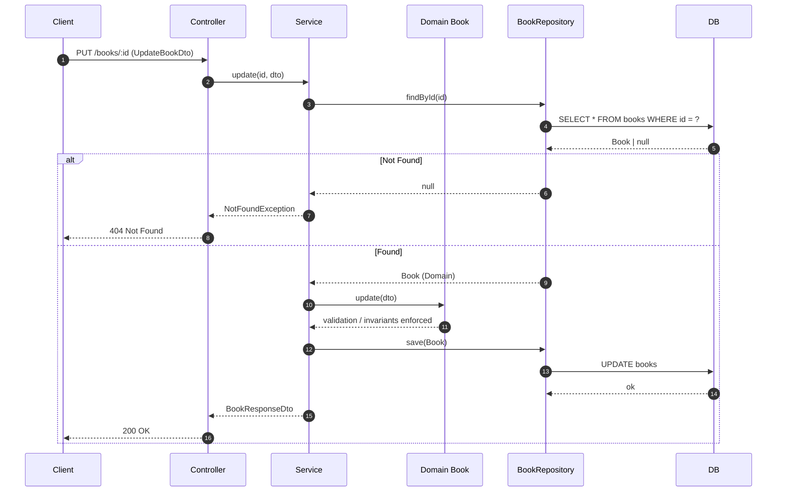
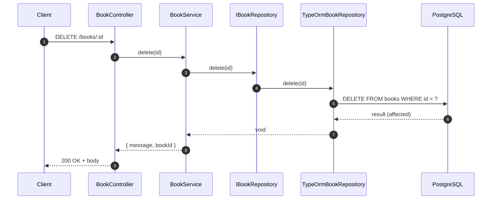

## ۱. ایجاد کتاب (Create Book)

```mermaid
sequenceDiagram
    autonumber
    participant Client
    participant Controller
    participant Service
    participant Book as Domain Book
    participant BookRepository
    participant DB

    Client->>Controller: POST /books (CreateBookDto)
    Controller->>Service: create(dto)

    Service->>BookRepository: existsByIsbn(isbn)
    BookRepository->>DB: SELECT 1 FROM books WHERE isbn = ?
    DB-->>BookRepository: true | false

    alt ISBN exists
        BookRepository-->>Service: true
        Service-->>Controller: ConflictException
        Controller-->>Client: 409
    else
        BookRepository-->>Service: false

        Service->>Book: create(dto)
        Book-->>Service: Book

        Service->>BookRepository: save(book)
        BookRepository->>DB: INSERT INTO books ...
        DB-->>BookRepository: ok

        Service-->>Controller: BookResponseDto
        Controller-->>Client: 201 Created
    end

```

## ۲. دریافت همه کتاب‌ها (Find All)

```mermaid
sequenceDiagram
    autonumber
    participant Client
    participant Controller
    participant Service
    participant BookRepository
    participant DB

    Client->>Controller: GET /books
    Controller->>Service: findAll()

    Service->>BookRepository: findAll()
    BookRepository->>DB: SELECT id, title, price, isbn, lang, status FROM books ORDER BY createdAt DESC
    DB-->>BookRepository: rows

    BookRepository-->>Service: BookReadModel[]
    Service-->>Controller: BookResponseDto[]
    Controller-->>Client: 200 OK
```

## ۳. دریافت یک کتاب با شناسه (Find One)

```mermaid
sequenceDiagram
    autonumber
    participant Client
    participant Controller
    participant Service
    participant BookRepository
    participant DB

    Client->>Controller: GET /books/:id
    Controller->>Service: findOne(id)

    Service->>BookRepository: findById(id)
    BookRepository->>DB: SELECT * FROM books WHERE id = ?
    DB-->>BookRepository: row | null

    alt not found
        BookRepository-->>Service: null
        Service-->>Controller: NotFoundException
        Controller-->>Client: 404
    else found
        BookRepository-->>Service: BookReadModel
        Service-->>Controller: BookResponseDto
        Controller-->>Client: 200
    end

```

## ۴. به‌روزرسانی کتاب (Update Book)

```mermaid
sequenceDiagram
    autonumber
    participant Client
    participant Controller
    participant Service
    participant Book as Domain Book
    participant BookRepository
    participant DB

    Client->>Controller: PUT /books/:id (UpdateBookDto)
    Controller->>Service: update(id, dto)

    Service->>BookRepository: findById(id)
    BookRepository->>DB: SELECT * FROM books WHERE id = ?
    DB-->>BookRepository: Book | null

    alt Not Found
        BookRepository-->>Service: null
        Service-->>Controller: NotFoundException
        Controller-->>Client: 404 Not Found
    else Found
        BookRepository-->>Service: Book (Domain)

        Service->>Book: update(dto)
        Book-->>Service: validation / invariants enforced

        Service->>BookRepository: save(Book)
        BookRepository->>DB: UPDATE books
        DB-->>BookRepository: ok

        Service-->>Controller: BookResponseDto
        Controller-->>Client: 200 OK
    end

```
## ۵. حذف کتاب (Delete Book)

```mermaid
sequenceDiagram
    autonumber
    participant Client
    participant BookController
    participant BookService
    participant IBookRepository
    participant TypeOrmBookRepository
    participant DB as PostgreSQL

    Client->>BookController: DELETE /books/:id
    BookController->>BookService: delete(id)

    BookService->>IBookRepository: delete(id)
    IBookRepository->>TypeOrmBookRepository: delete(id)
    TypeOrmBookRepository->>DB: DELETE FROM books WHERE id = ?
    DB-->>TypeOrmBookRepository: result (affected)
    TypeOrmBookRepository-->>BookService: void

    BookService-->>BookController: { message, bookId }
    BookController-->>Client: 200 OK + body
```
