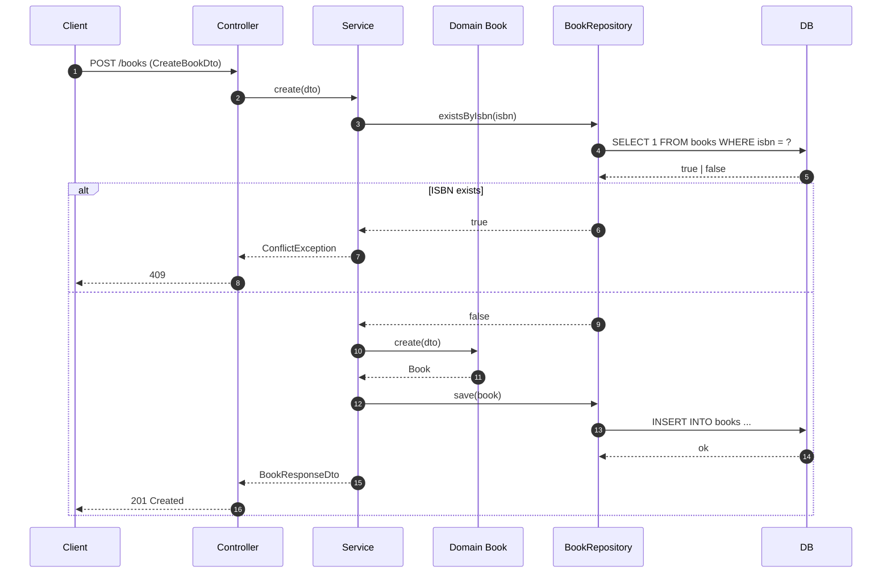
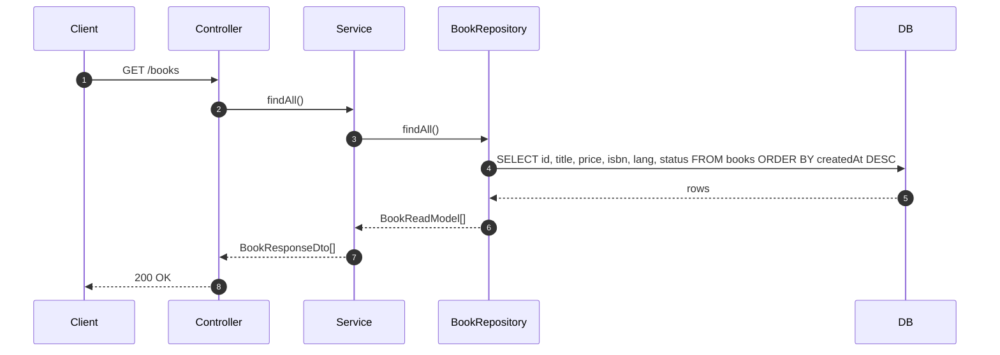

## ۱. ایجاد کتاب (Create Book)

```mermaid
sequenceDiagram
    autonumber
    participant Client
    participant Controller
    participant Service
    participant Book as Domain Book
    participant BookRepository
    participant DB

    Client->>Controller: POST /books (CreateBookDto)
    Controller->>Service: create(dto)

    Service->>BookRepository: existsByIsbn(isbn)
    BookRepository->>DB: SELECT 1 FROM books WHERE isbn = ?
    DB-->>BookRepository: true | false

    alt ISBN exists
        BookRepository-->>Service: true
        Service-->>Controller: ConflictException
        Controller-->>Client: 409
    else
        BookRepository-->>Service: false

        Service->>Book: create(dto)
        Book-->>Service: Book

        Service->>BookRepository: save(book)
        BookRepository->>DB: INSERT INTO books ...
        DB-->>BookRepository: ok

        Service-->>Controller: BookResponseDto
        Controller-->>Client: 201 Created
    end

```

## ۲. دریافت همه کتاب‌ها (Find All)

```mermaid
sequenceDiagram
    autonumber
    participant Client
    participant Controller
    participant Service
    participant BookRepository
    participant DB

    Client->>Controller: GET /books
    Controller->>Service: findAll()

    Service->>BookRepository: findAll()
    BookRepository->>DB: SELECT id, title, price, isbn, lang, status FROM books ORDER BY createdAt DESC
    DB-->>BookRepository: rows

    BookRepository-->>Service: BookReadModel[]
    Service-->>Controller: BookResponseDto[]
    Controller-->>Client: 200 OK
```
