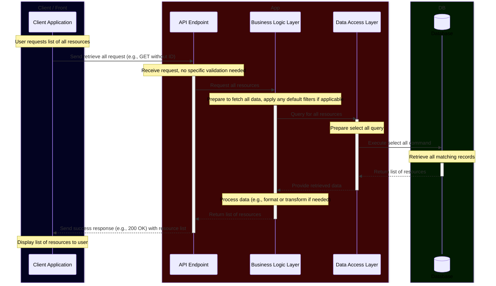

# find All

```mermaid
sequenceDiagram
    box rgb(3, 3, 33) Client / Front
    participant Client as Client Application
    end
    box rgb(61, 5, 5) App
    participant API as API Endpoint
    participant Logic as Business Logic Layer
    participant DataAccess as Data Access Layer
    end
    box rgb(2, 27, 2) DB
    participant Database@{"type":"database"}
    end
    Note over Client: User requests list of all resources
    Client->>API: Send retrieve all request (e.g., GET without ID)
    Note over API: Receive request, no specific validation needed
    activate API
    API->>Logic: Request all resources
    Note over Logic: Prepare to fetch all data, apply any default filters if applicable
    activate Logic
    Logic->>DataAccess: Query for all resources
    activate DataAccess
    Note over DataAccess: Prepare select all query
    DataAccess->>Database: Execute select all command
    Note over Database: Retrieve all matching records
    activate Database
    Database-->>DataAccess: Return list of resources
    deactivate Database
    DataAccess-->>Logic: Provide retrieved data
    deactivate DataAccess
    Note over Logic: Process data (e.g., format or transform if needed)
    Logic-->>API: Return list of resources
    deactivate Logic
    API-->>Client: Send success response (e.g., 200 OK) with resource list
    deactivate API
    Note over Client: Display list of resources to user
```