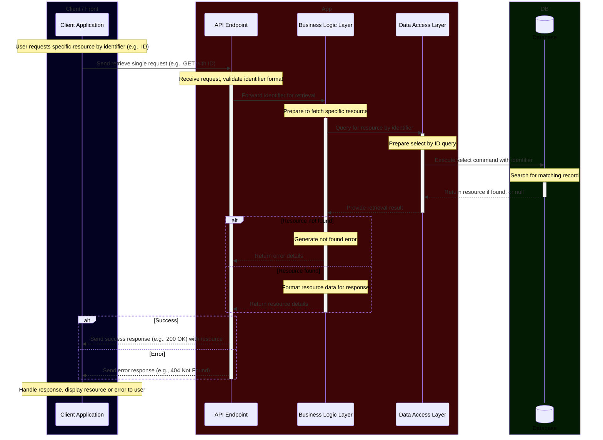

# Find One

```mermaid
sequenceDiagram
    box rgb(3, 3, 33) Client / Front
    participant Client as Client Application
    end
    box rgb(61, 5, 5) App
    participant API as API Endpoint
    participant Logic as Business Logic Layer
    participant DataAccess as Data Access Layer
    end
    box rgb(2, 27, 2) DB
    participant Database@{"type":"database"}
    end
    Note over Client: User requests specific resource by identifier (e.g., ID)
    Client->>API: Send retrieve single request (e.g., GET with ID)
    Note over API: Receive request, validate identifier format
    activate API
    API->>Logic: Forward identifier for retrieval
    Note over Logic: Prepare to fetch specific resource
    activate Logic
    Logic->>DataAccess: Query for resource by identifier
    activate DataAccess
    Note over DataAccess: Prepare select by ID query
    DataAccess->>Database: Execute select command with identifier
    Note over Database: Search for matching record
    activate Database
    Database-->>DataAccess: Return resource if found, or null
    deactivate Database
    DataAccess-->>Logic: Provide retrieval result
    deactivate DataAccess
    alt Resource not found
        Note over Logic: Generate not found error
        Logic-->>API: Return error details
    else Resource found
        Note over Logic: Format resource data for response
        Logic-->>API: Return resource details
    end
    deactivate Logic
    alt Success
        API-->>Client: Send success response (e.g., 200 OK) with resource
    else Error
        API-->>Client: Send error response (e.g., 404 Not Found)
    end
    deactivate API
    Note over Client: Handle response, display resource or error to user
```