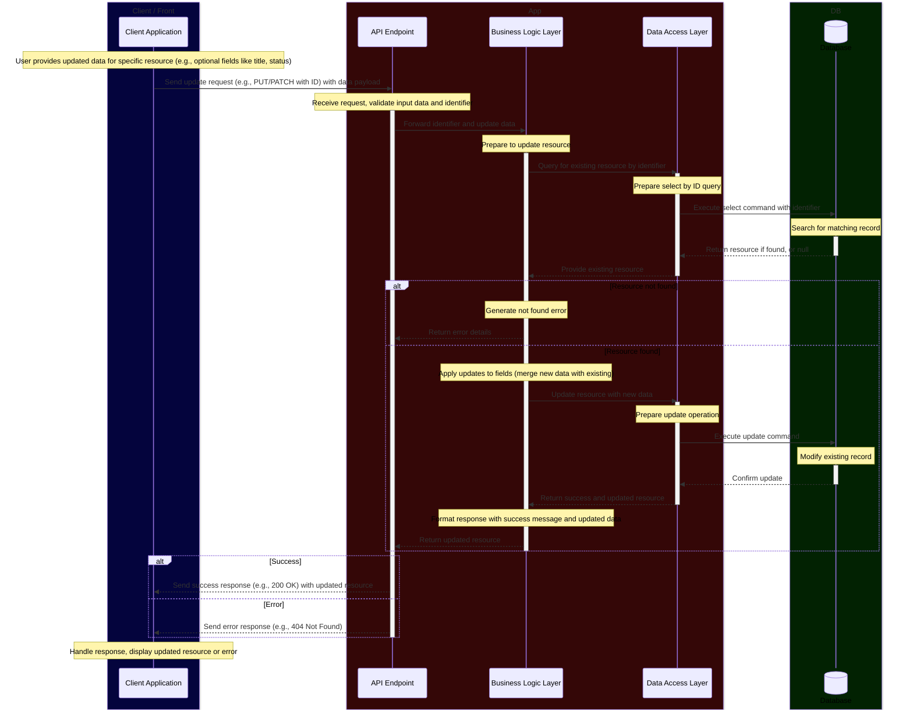

# Update book

```mermaid
sequenceDiagram
    box rgb(4, 4, 61) Client / Front
    participant Client as Client Application
    end
    box rgb(52, 7, 7) App
    participant API as API Endpoint
    participant Logic as Business Logic Layer
    participant DataAccess as Data Access Layer
    end
    box rgb(2, 34, 2) DB
    participant Database@{"type":"database"}
    end
    Note over Client: User provides updated data for specific resource (e.g., optional fields like title, status)
    Client->>API: Send update request (e.g., PUT/PATCH with ID) with data payload
    Note over API: Receive request, validate input data and identifier
    activate API
    API->>Logic: Forward identifier and update data
    Note over Logic: Prepare to update resource
    activate Logic
    Logic->>DataAccess: Query for existing resource by identifier
    activate DataAccess
    Note over DataAccess: Prepare select by ID query
    DataAccess->>Database: Execute select command with identifier
    Note over Database: Search for matching record
    activate Database
    Database-->>DataAccess: Return resource if found, or null
    deactivate Database
    DataAccess-->>Logic: Provide existing resource
    deactivate DataAccess
    alt Resource not found
        Note over Logic: Generate not found error
        Logic-->>API: Return error details
    else Resource found
        Note over Logic: Apply updates to fields (merge new data with existing)
        Logic->>DataAccess: Update resource with new data
        activate DataAccess
        Note over DataAccess: Prepare update operation
        DataAccess->>Database: Execute update command
        Note over Database: Modify existing record
        activate Database
        Database-->>DataAccess: Confirm update
        deactivate Database
        DataAccess-->>Logic: Return success and updated resource
        deactivate DataAccess
        Note over Logic: Format response with success message and updated data
        Logic-->>API: Return updated resource
    end
    deactivate Logic
    alt Success
        API-->>Client: Send success response (e.g., 200 OK) with updated resource
    else Error
        API-->>Client: Send error response (e.g., 404 Not Found)
    end
    deactivate API
    Note over Client: Handle response, display updated resource or error
```
